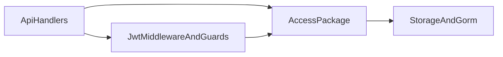

# Squash Auth/Security Into One Access-Control Unit

## Goal

Merge fragmented security logic into a single cohesive module so ownership is obvious and cross-package hops disappear.

Current targets to merge:

- `[/Users/florianthievent/workspace/private/spoutmc/internal/auth/jwt.go](/Users/florianthievent/workspace/private/spoutmc/internal/auth/jwt.go)`
- `[/Users/florianthievent/workspace/private/spoutmc/internal/authz/check.go](/Users/florianthievent/workspace/private/spoutmc/internal/authz/check.go)`
- `[/Users/florianthievent/workspace/private/spoutmc/internal/authz/effective.go](/Users/florianthievent/workspace/private/spoutmc/internal/authz/effective.go)`
- `[/Users/florianthievent/workspace/private/spoutmc/internal/authz/userresponse.go](/Users/florianthievent/workspace/private/spoutmc/internal/authz/userresponse.go)`
- `[/Users/florianthievent/workspace/private/spoutmc/internal/security/password.go](/Users/florianthievent/workspace/private/spoutmc/internal/security/password.go)`
- `[/Users/florianthievent/workspace/private/spoutmc/internal/permissions/registry.go](/Users/florianthievent/workspace/private/spoutmc/internal/permissions/registry.go)`
- `[/Users/florianthievent/workspace/private/spoutmc/internal/permissions/db.go](/Users/florianthievent/workspace/private/spoutmc/internal/permissions/db.go)`
- `[/Users/florianthievent/workspace/private/spoutmc/internal/permissions/roleseed.go](/Users/florianthievent/workspace/private/spoutmc/internal/permissions/roleseed.go)`

## Target Package Shape

Create one package namespace: `internal/access` with clear files by concern:

- `jwt.go` (claims + token issue/verify)
- `password.go` (hash/verify)
- `checks.go` (DB and claims authorization checks)
- `effective.go` (effective permission resolution)
- `permissions_registry.go` (default permission definitions)
- `permissions_seed.go` (role-permission seed mapping)
- `permissions_db.go` (all-keys DB helpers)
- `userresponse.go` (user response projection, unless moved later)

## Architecture (Post-merge)

## Implementation Phases

### Phase 1: Add `internal/access` as compatibility layer

- Introduce `internal/access` with copied/adapted implementations from current auth/authz/security/permissions.
- Keep exported function names as close as possible (e.g. `GenerateToken`, `VerifyToken`, `ClaimsHasPermission`, `UserHasRole`, `Hash`, `Verify`, `Definitions`, `RolePermissionKeys`, `AllKeysFromDB`).
- Do not delete old packages yet.

### Phase 2: Rewire all imports to `internal/access`

Update all direct consumers, especially:

- `[/Users/florianthievent/workspace/private/spoutmc/internal/webserver/middleware/jwt.go](/Users/florianthievent/workspace/private/spoutmc/internal/webserver/middleware/jwt.go)`
- `[/Users/florianthievent/workspace/private/spoutmc/internal/webserver/guards/guards.go](/Users/florianthievent/workspace/private/spoutmc/internal/webserver/guards/guards.go)`
- `[/Users/florianthievent/workspace/private/spoutmc/internal/webserver/api/v1/auth/auth.go](/Users/florianthievent/workspace/private/spoutmc/internal/webserver/api/v1/auth/auth.go)`
- `[/Users/florianthievent/workspace/private/spoutmc/internal/webserver/api/v1/user/user.go](/Users/florianthievent/workspace/private/spoutmc/internal/webserver/api/v1/user/user.go)`
- `[/Users/florianthievent/workspace/private/spoutmc/internal/webserver/api/v1/plugin/plugin.go](/Users/florianthievent/workspace/private/spoutmc/internal/webserver/api/v1/plugin/plugin.go)`
- `[/Users/florianthievent/workspace/private/spoutmc/internal/webserver/api/v1/setup/setup.go](/Users/florianthievent/workspace/private/spoutmc/internal/webserver/api/v1/setup/setup.go)`
- `[/Users/florianthievent/workspace/private/spoutmc/internal/storage/db.go](/Users/florianthievent/workspace/private/spoutmc/internal/storage/db.go)`

### Phase 3: Remove legacy package usage and preserve behavior

- Ensure there are zero imports of `internal/auth`, `internal/authz`, `internal/security`, `internal/permissions` from non-compat files.
- Preserve semantics:
  - JWT claims behavior (including stale-claims caveat in claim-based checks)
  - `RequireAdmin` remains DB-backed role check
  - admin “all permissions” still resolved from DB keys
  - setup/login/user password flows unchanged

### Phase 4: Delete legacy package files/directories

- Delete old files once no references remain.
- Optionally keep short-lived shims only if needed for staged rollout; otherwise remove in same PR for full squash.

## Risk Controls

- Avoid behavior changes while merging; this is a package-boundary refactor first.
- Keep constant names/strings stable (`admin`, `manager`, `plugins.manage`).
- Watch for import cycles (`access` must not import webserver API packages).

## Validation Checklist

- No remaining imports of `internal/auth`, `internal/authz`, `internal/security`, `internal/permissions` in active code.
- `internal/webserver/middleware/jwt.go` and `internal/webserver/guards/guards.go` compile and preserve auth behavior.
- Auth/login/setup/user/plugin/permission routes compile with unchanged contracts.
- Lints clean on touched files.
- `go test ./...` executed to baseline limits; document existing unrelated failures if present.

## Expected Result

A single `internal/access` ownership boundary for authn + authz + permissions, significantly lower cognitive load, and simpler future changes to security policy.