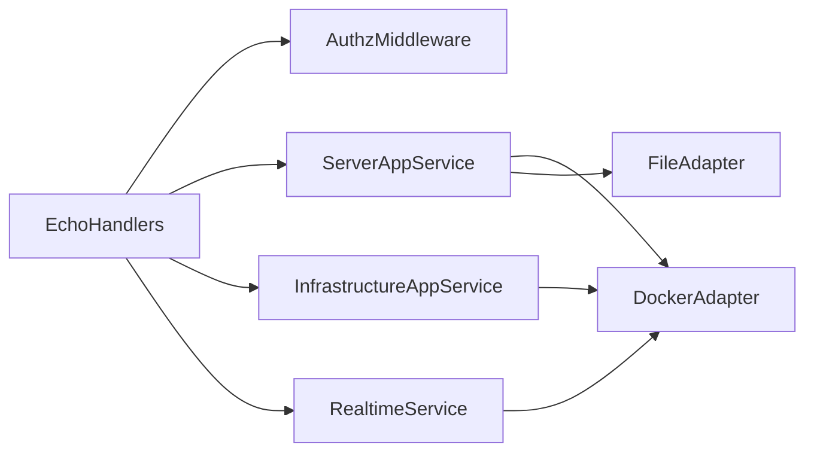

# Refactor `internal/` Into Clear Logic Units

## Goal

Break up oversized API files in `internal/webserver` into maintainable logic units with explicit boundaries:

- transport (Echo handlers)
- application services (orchestration)
- infrastructure adapters (Docker/files/SSE/WS)

Primary targets:

- `[/Users/florianthievent/workspace/private/spoutmc/internal/webserver/api/v1/server/server.go](/Users/florianthievent/workspace/private/spoutmc/internal/webserver/api/v1/server/server.go)`
- `[/Users/florianthievent/workspace/private/spoutmc/internal/webserver/api/v1/infrastructure/infrastructure.go](/Users/florianthievent/workspace/private/spoutmc/internal/webserver/api/v1/infrastructure/infrastructure.go)`
- `[/Users/florianthievent/workspace/private/spoutmc/internal/webserver/api/v1/ws/ws.go](/Users/florianthievent/workspace/private/spoutmc/internal/webserver/api/v1/ws/ws.go)`
- Wiring point: `[/Users/florianthievent/workspace/private/spoutmc/internal/webserver/webserver.go](/Users/florianthievent/workspace/private/spoutmc/internal/webserver/webserver.go)`

## Proposed Target Architecture

## Refactor Units

### 1) Split transport from orchestration in server API

- Keep route definitions and request/response DTO conversion in `api/v1/server` handlers.
- Move business orchestration into a new application unit (e.g. `internal/serverapp`): lifecycle actions, config-file operations, logs/stats stream setup.
- Extract handler methods into grouped files by concern (e.g. `handlers_lifecycle.go`, `handlers_files.go`, `handlers_streams.go`) to remove the 1.5k-line hotspot.

### 2) Unify duplicated streaming patterns (`server` + `infrastructure`)

- Create shared stream primitives (e.g. `internal/realtime/sse`): header setup, heartbeat/ticker loop, context cancellation, event writer.
- Refactor both API packages to call shared stream helpers rather than duplicating flush loops.
- Keep event payload semantics unchanged to avoid frontend regressions.

### 3) Re-architect WebSocket logic into a dedicated realtime unit

- Move WS protocol/session concerns out of `api/v1/ws/ws.go` into `internal/realtime/ws`:
  - connection/session lifecycle
  - subscription routing
  - stream multiplexer to Docker-backed sources
- Keep Echo upgrader and auth entrypoint thin in API package.

### 4) Introduce explicit dependency injection for API modules

- In `[/Users/florianthievent/workspace/private/spoutmc/internal/webserver/webserver.go](/Users/florianthievent/workspace/private/spoutmc/internal/webserver/webserver.go)`, instantiate service structs once and inject into route registration.
- Remove hidden coupling via package-level access patterns where possible in this slice.
- Establish interfaces for external adapters (Docker/files) to make the new services testable.

### 5) Consolidate shared API guard/middleware behavior

- Replace per-file repeated admin/claims checks with centralized middleware helpers used by server/infrastructure/ws modules.
- Standardize error response format/status handling at middleware boundary.

## Rollout Strategy (Aggressive, Controlled)

- Phase A: scaffolding (new packages/interfaces + no-op wiring).
- Phase B: move server API orchestration first (largest clutter reduction).
- Phase C: apply shared SSE/realtime units to infrastructure + ws.
- Phase D: remove dead code and finalize package boundary cleanup.
- Feature parity checks after each phase with existing endpoint contracts.

## Validation Checklist

- Existing server/infrastructure/ws routes still registered and reachable.
- SSE endpoints preserve event cadence and disconnect behavior.
- WS subscribe/unsubscribe semantics preserved.
- Start/stop/restart and logs/stats endpoints produce equivalent results.
- No new lint errors in touched files.

## Expected Outcomes

- Monolith files reduced into focused logic units.
- Clear ownership of business logic vs transport concerns.
- Lower cognitive load for future changes in `internal/webserver`.
- Better unit/integration testability via injected interfaces.

