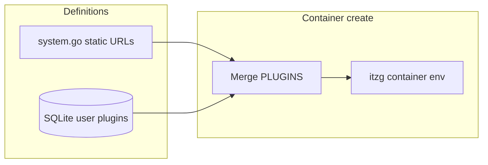

# Plugin registry for SpoutMC

## What you are building

- **Registry**: Users define **plugins** (name, download URL, optional description) and assign each to **one or many servers** by server name (matching `[SpoutServer.Name](internal/models/spoutmodel.go)`).
- **Runtime**: [itzg/minecraft-server](https://docker-minecraft-server.readthedocs.io/) and [itzg/mc-proxy](https://github.com/itzg/docker-mc-proxy) both honor `**PLUGINS`** — a newline- or comma-separated list of JAR URLs; the image downloads missing JARs into the data/plugins area on start.
- **System-managed plugins**: Defined in **Go source** (map/slice, versioned with releases), tagged **system-managed** in the API/UI, **not deletable**. Scoped by **server kind**: `proxy`, `lobby`, `game` (same classification as `[DetermineServerType](internal/server/lifecycle.go)` / `io.spout.*` labels).
- **User-managed plugins**: Stored in SQLite; **delete only allowed when zero servers reference** the plugin.
- **Authorization**: **View** registry (list + see server usage): keep `[server.list.read](internal/permissions/registry.go)` (already describes plugins). **Create/update/delete** and **mutations that recreate containers**: require `**plugins.manage`** **or** JWT role `**admin`** **or** `**manager`**. Implement this consistently in **Echo handlers** (today fine-grained keys are mostly UI-only; `[ClaimsHasPermission](internal/authz/check.go)` exists but is unused on routes — plugin routes should use it plus role checks).

## Where to define system-managed plugins

Add a small package, e.g. `[internal/plugins/system.go](internal/plugins/system.go)` (or extend `[internal/plugins/server_tap.go](internal/plugins/server_tap.go)` if you prefer one folder), exporting something like:

- A type for server kind: `proxy | lobby | game`.
- A slice or map of entries: stable `ID`, display `Name`, `URL`, and which kinds apply (e.g. `[]ServerKind` or three lists).

This is the **single source of truth** for built-in URLs; change only when shipping a new SpoutMC version.

## Data model (SQLite + GORM)

- New models (e.g. `UserPlugin`, `UserPluginServer`) in `[internal/models/](internal/models/)` with `AutoMigrate` in `[internal/storage/db.go](internal/storage/db.go)`:
  - User plugin: `ID`, `Name`, `URL` (JAR), optional `Description`, timestamps.
  - Assignment: many-to-many via join table **or** `plugin_id` + `server_name` string (simpler; validate `server_name` exists in `[config.All().Servers](internal/config/config_loader.go)` on write).

## Backend: merge `PLUGINS` into container env

**Single merge helper** (e.g. `internal/plugins/env.go`):

1. Resolve **server kind** from `models.SpoutServer` (`Proxy` / `Lobby` / default game).
2. Collect **system** URLs for that kind from the static map.
3. Load **user** URLs assigned to this server name from the DB.
4. Optionally append URLs from `**s.Env["PLUGINS"]`** if present (advanced users); dedupe by URL string.
5. Join with newlines (compose-friendly) into one `PLUGINS` value.

Call this from `[docker.StartContainer](internal/docker/docker.go)` **immediately before** `MapEnvironmentVariables(s.Env)` when **creating** the container (the branch where `!containerExists`), so the merged value is what Docker sees. **Do not** persist computed `PLUGINS` into `spoutmc.yaml` unless you explicitly want GitOps to show it — recommended: **keep YAML as today**; inject only at runtime.

**Existing containers**: `[StartContainer](internal/docker/docker.go)`’s `else` branch only starts/restarts — **env is not updated**. `[RecreateContainer](internal/docker/docker.go)` already removes and recreates, so it will pick up new `PLUGINS`. After plugin CRUD, **recreate affected servers** (load `models.SpoutServer` from config by name, `dataPath` from config, then `RecreateContainer`) so changes apply without manual server-edit. Document brief downtime per recreated server.

**Edge case**: Server rename in YAML leaves old assignment rows pointing at a stale name — acceptable to document; optional follow-up is updating assignments in the server rename path (`[updateServerHandler](internal/webserver/api/v1/server/server.go)`).

## HTTP API (Echo)

- New package `[internal/webserver/api/v1/plugin/plugin.go](internal/webserver/api/v1/plugin/plugin.go)` (name TBD), registered in `[internal/webserver/api/v1/v1.go](internal/webserver/api/v1/v1.go)` on `protected`.
- **GET `/plugin` or `/plugins`**: Returns **union** of system entries (flag `systemManaged: true`, include `applicableKinds` or derived server list labels) and user rows with **assigned server names** and usage counts.
- **POST/PUT/DELETE** (user plugins only): Middleware or first-line check: `admin` OR `manager` OR `plugins.manage` (use JWT claims + mirror logic in `[authz](internal/authz/check.go)`; add a small `ClaimsCanManagePlugins` helper).
- **DELETE**: Return **409** if any assignment exists.
- Validation: URL scheme `http`/`https`; server names must exist in loaded config.

## Permissions seed

- Add `plugins.manage` to `[internal/permissions/registry.go](internal/permissions/registry.go)` (description: manage plugin registry and assignments).
- Add `plugins.manage` to `[internal/permissions/roleseed.go](internal/permissions/roleseed.go)` for `**manager`** (and rely on existing **admin = all keys** via `[EffectivePermissionKeys](internal/authz/effective.go)`).
- Existing DBs: rely on the same “insert missing keys” pattern used elsewhere for permission definitions (confirm in `[storage/db.go](internal/storage/db.go)` / permissions sync).

## Web frontend

- `[web/src/service/apiService.ts](web/src/service/apiService.ts)`: add plugin list/create/update/delete functions.
- Replace mock `[web/src/store/pluginStore.ts](web/src/store/pluginStore.ts)` with API-backed state (or inline in components like other pages).
- `[web/src/types/index.ts](web/src/types/index.ts)`: align `Plugin` type with API (`systemManaged`, `jarUrl`, `servers: string[]`, etc.).
- `[web/src/components/Plugins/PluginsList.tsx](web/src/components/Plugins/PluginsList.tsx)`: PatternFly **table** pattern (see `[UsersList.tsx](web/src/components/Configuration/Users/UsersList.tsx)`): columns for name, URL (truncated), **servers** (labels/chips), **system-managed** badge, actions.
- `[AddPluginModal.tsx` / `ConfigurePluginModal.tsx](web/src/components/Plugins/)`: real forms — multi-select or dual-list of servers from existing `getServers()` / store.
- **Route** in `[App.tsx](web/src/App.tsx)`: keep `**server.list.read`** for the page; use `[useAuthStore](web/src/store/authStore.ts)` to show Add/Edit/Delete only when `hasRole('admin') || hasRole('manager') || hasPermission('plugins.manage')` (extend `hasPermission` does **not** treat manager specially today — **must check role explicitly in UI**, matching backend).
- **Nav**: `[NAV_ITEMS_RAW](web/src/App.tsx)` can stay gated by `server.list.read`; no need to require `plugins.manage` for the nav item if the page handles read-only UX.

## Testing

- Go unit tests for URL merge / kind filtering (table-driven).
- Optional: handler tests for 403/409 with mocked claims.

## Files likely touched (concise)

| Area                      | Files                                                                                                                                                                      |
| ------------------------- | -------------------------------------------------------------------------------------------------------------------------------------------------------------------------- |
| System plugin definitions | New `internal/plugins/system.go` (+ merge helper)                                                                                                                          |
| DB                        | New models, `[storage/db.go](internal/storage/db.go)` `AutoMigrate`                                                                                                        |
| Docker                    | `[docker.go](internal/docker/docker.go)` `StartContainer` inject `PLUGINS`                                                                                                 |
| API                       | New `v1/plugin`, `[v1.go](internal/webserver/api/v1/v1.go)`, authz helper                                                                                                  |
| Permissions               | `[registry.go](internal/permissions/registry.go)`, `[roleseed.go](internal/permissions/roleseed.go)`                                                                       |
| Web                       | `[apiService.ts](web/src/service/apiService.ts)`, `[pluginStore.ts](web/src/store/pluginStore.ts)`, Plugins components, `[App.tsx](web/src/App.tsx)` if route props change |

